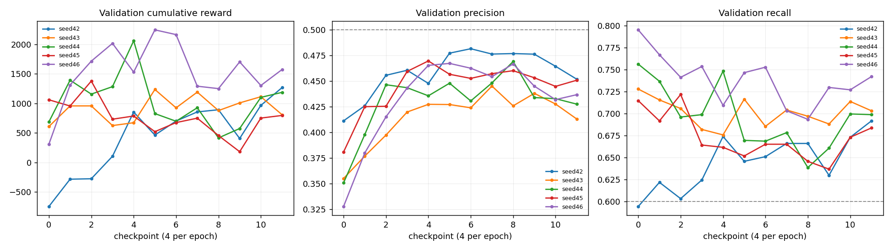

# 问题3：基于深度强化学习的自适应预警策略 —— 离线回测报告

> 本报告由 `scripts/report_drl.py` 生成。**全部实验结果数字**（累计奖励、精确率、
> 召回率、提前时间、判别力、标准差、消融、验证门结论）均从 `data_out/drl` 下的
> `results.json` / `ablation_reward.json` / `gates.json` / `sweep.json` /
> `history_seed*.csv` 读出后格式化，重跑训练后重新执行本脚本即可整体刷新。
> 文中的**口径常量**（120 分钟窗口、状态维度、赛题目标阈值等）属固定描述，写在正文里。

## 1. 任务与评测口径

赛题问题3 要求：以曲面风险特征为状态、预警等级为动作、以历史预警正确/虚假/漏报的累积奖励为优化目标，训练 DRL 智能体动态调整预警策略，并在离线回测中与固定阈值方法对比。加分门槛为**累计奖励或 CVaR 改善率相对固定规则提升 ≥10%**。

数据来自 `data_out/anchor/`（由 `scripts/build_anchor_dataset.py` 生成）：7 个品种（ag/au/cu/lc/rb/sc/si）、每 (品种,月) 一幕，共 263 幕。严格按时间先后切分，测试集全部晚于训练集：

| 划分 | 区间 | 幕数 | 风险起点数 | 用途 |
|------|------|------|-----------|------|
| 训练 | 2023-01 .. 2024-12 | 162 | 4286 | 拟合网络与归一化统计量 |
| 验证 | 2024-12+ .. 2025-06 | 42 | 1132 | 选超参、选 checkpoint |
| 测试 | 2025-06+ .. 2026-04 | 59 | 1767 | DRL 侧不做任何选择 |

测试集覆盖 2026-01 白银与 2026-03 原油两次极端行情，是赛题最关注的时段。

> 一处需要如实声明的例外：DRL 的超参与 checkpoint 全部只用验证集选，测试集不参与；但**盲节奏基线的周期**（每 N 步报一次）是在被评估的那个数据集上取最优的。这个方向是**对基线有利、对本文结论从严**——它把对照线做强了，不会抬高 DRL 的成绩。

精确率/召回率/平均提前时间的计算完全复用赛题口径，并通过验证门 G2 与既有实现 `vol_surface/quant_metrics.evaluate_quant` 逐位比对一致。

## 2. MDP 设计

**状态（34 维）**：32 维风险特征（26 维曲面 + 6 维标的侧）（训练集统计量 z-score 归一、截断 ±5）+ 2 维决策上下文（距上次预警的分钟数、上一步动作）。上下文这两维让智能体能感知「我刚报过了」，从而学会抑制冗余预警——这是无状态的固定阈值规则做不到的。状态中不含任何未来信息，由验证门 G1 强制保证。

**动作**：0=无预警 / 1=关注 / 2=警告 / 3=危险，与赛题四级定义一致。

**奖励**：事件级会计，直接映射赛题指标——

| 事件 | 触发条件 | 奖励 |
|------|---------|------|
| cover | 首次覆盖某风险起点的 level≥2 预警 | `+6·(1+提前占比)·等级系数` |
| redundant | 预警正确但该风险起点已被更早预警覆盖 | `+0.2·等级系数` |
| false | 预警后 120min 内无风险起点 | `−1.0·等级系数` |
| miss | 风险起点走过时从未被覆盖 | `−10` |
| watch | level==1（不计入赛题预警集合） | `±0.05` 量级整形 |

实际参数：`cover=6.0 miss=10.0 true=0.2 fp=1.0 lead=1.0 gain=(0.0, 0.0, 1.0, 1.15) cost=(0.0, 0.0, 1.0, 1.6)`

> **踩过的坑2**：环境最初把「恰好在风险起点当根 K 线发出的预警」同时记成误报与漏报，而赛题的两个 120 分钟窗口 `[rs−120, rs]` 与 `[a, a+120]` 都是闭区间、这类预警应算命中。修正后，环境的 cover/miss 计数与赛题指标的召回/漏报数**完全相等**（验证门 G3）。

## 3. 训练设置

- 算法：Double DQN（在线网选动作、目标网估值）+ 经验回放 + Huber 损失
- 网络：34 → 128 → 128 → 4 的 MLP，**纯 NumPy 手写前反向**
- 超参（在验证集上小规模搜索选出）：γ=0.9、lr=0.001、weight_decay=0.0001
- 随机种子：[42, 43, 44, 45, 46, 47, 48, 49, 50, 51, 52, 53, 54, 55, 56]，共 15 个独立训练

不引入 PyTorch 的理由：本项目原依赖里没有任何深度学习框架，而这里只需要一个两万参数量级的小 MLP；纯 NumPy 可完全确定性复现（验证门 G6），CPU 数分钟跑完，评审复现零环境成本。

超参搜索结果（只看验证集）：

| γ | lr | hidden | weight_decay | 验证集累计奖励 |
|---|----|--------|--------------|---------------|
| 0.9 | 0.001 | 128 | 0.0001 | 570.2 |
| 0.95 | 0.001 | 128 | 0.0001 | 517.9 |
| 0.95 | 0.001 | 128 | 0.0 | 394.5 |

训练过程明显过拟合：训练奖励持续上升而验证奖励很早见顶。**5/15 个 seed 留有逐评估历史**（其余未保存 `history_seed*.csv`），这几个的最优 checkpoint 位置为 `e2.3`, `e1.1`, `e1.0`, `e0.2`, `e1.1`（tag 形如 `e0.2` 表示第 0 个 epoch 的第 3 次评估，每 epoch 评估 4 次），其中 1/5 个在**第 1 个 epoch 之内**就到顶。因此采用 epoch 内多次评估 + 保留验证集最优 checkpoint 的早停策略。**该观察基于这 5 个 seed，不宜外推到全部 15 个。**

权重衰减消融（同为 γ=0.95）：wd=0 时验证集累计奖励 394.5，wd=0.0001 时 517.9。注意出厂配置最终选的是 γ=0.9，该消融是在 γ=0.95 下做的受控对比，搜索网格中没有 γ=0.9 + wd=0 的组合。



*各 seed 在验证集上的累计奖励 / 精确率 / 召回率随 checkpoint 的变化；虚线为赛题目标线。*

## 4. 主结果（测试集 2025-07 .. 2026-04）

「判别力」= 精确率 − hit 基础率（24.41%）。会预警但不看特征的策略，其精确率必然≈基础率、判别力≈0，因此这一列才是「有没有真正学到曲面信号」的硬指标。

> 一个口径说明：「恒不预警」从不发预警，精确率按 0 计，故判别力显示为 -24.41%。这是分母为空的退化情形，不参与上述解读。

| 策略 | 累计奖励 | 精确率 | 召回率 | 平均提前 | 预警数 | 预警率 | 判别力 |
|------|---------|--------|--------|---------|--------|--------|--------|
| **规则基线**（问题1 校准阈值） | -5,121.7 | 44.0% ✗ | 45.9% ✗ | 48.8 ✓ | 4,376 | 14.7% | 19.60% |
| **最佳盲节奏(每3步,不看特征)** | -127.3 | 25.4% ✗ | 74.8% ✓ | 53.6 ✓ | 9,912 | 33.4% | 1.03% |
| 随机策略 | -6,879.7 | 24.2% ✗ | 45.4% ✗ | 51.7 ✓ | 5,000 | 16.8% | -0.25% |
| 恒不预警 level0 | -17,670.0 | 0.0% ✗ | 0.0% ✗ | 0.0 ✗ | 0 | 0.0% | -24.41% |
| 恒警告 level2 | -6,453.5 | 24.4% ✗ | 100.0% ✓ | 48.7 ✓ | 29,696 | 100.0% | -0.03% |
| **DRL 单 seed 均值**（n=15） | 1,432.4 ± 971.6 | 39.8% ✗ | 74.2% ✓ | 42.3 ✓ | — | 24.8% | 15.35% |
| **DRL 集成**（多 seed Q 值平均） | 4,236.4 | 45.1% ✗ | 79.4% ✓ | 38.8 ✓ | 6,379 | 21.5% | 20.72% |
| 预言机上界（每个风险起点前恰好报一次） | 17,141.3 | — | — | — | — | — | — |

各 seed 明细：

| seed | 累计奖励 | 精确率 | 召回率 | 平均提前 | 预警率 |
|------|---------|--------|--------|---------|--------|
| 42 | 659.0 | 43.4% | 66.7% | 40.4 | 17.8% |
| 43 | 1,648.0 | 42.6% | 72.4% | 42.4 | 22.3% |
| 44 | 3,022.2 | 41.6% | 77.6% | 42.1 | 23.4% |
| 45 | 1,775.6 | 38.9% | 74.5% | 42.8 | 24.1% |
| 46 | 1,707.4 | 38.7% | 75.8% | 42.5 | 26.3% |
| 47 | 2,244.3 | 39.1% | 77.5% | 43.4 | 27.4% |
| 48 | -551.8 | 34.2% | 73.6% | 42.2 | 28.9% |
| 49 | 616.1 | 44.3% | 66.4% | 39.9 | 18.3% |
| 50 | 2,951.5 | 37.6% | 81.9% | 43.9 | 30.0% |
| 51 | 539.6 | 38.1% | 72.7% | 43.8 | 25.5% |
| 52 | 1,153.5 | 36.1% | 77.0% | 39.6 | 26.4% |
| 53 | 2,088.3 | 41.7% | 73.1% | 40.3 | 20.0% |
| 54 | 1,722.7 | 40.2% | 75.0% | 44.7 | 27.2% |
| 55 | 1,785.4 | 44.0% | 71.3% | 41.9 | 20.7% |
| 56 | 124.8 | 36.0% | 77.2% | 45.0 | 34.3% |

## 5. 结论与赛题门槛对照

相对固定阈值规则基线的累计奖励提升：**单 seed 均值 +128.0%**、**集成 +182.7%**，均远超赛题 ≥10% 的加分门槛。

若以「基线→预言机上界」的差距（22,263.1）为标尺，单 seed 均值收复其中 **+29.4%**，集成收复 **+42.0%**。

赛题主指标达标情况（测试集，DRL 集成，**贪心工作点 lean=0**）：

| 指标 | 目标 | 规则基线 | DRL 集成 | 达标 |
|------|------|---------|---------|------|
| 精确率 | ≥50% | 44.0% | 45.1% | ✗ |
| 召回率 | ≥60% | 45.9% | 79.4% | ✓ |
| 平均提前 | ≥30min | 48.8min | 38.8min | ✓ |

### 交付工作点（不是上表的贪心点）

贪心（`lean=0`）不是最优工作点。沿 P-R 前沿移动置信度门槛 `lean`，**只用验证集**挑选（约束：召回≥60% 且 平均提前≥30min，其中精确率最大），选出 `lean=0.30`（验证集精确率 59.0%）。该阈值在测试集上给出：

> ⚠️ **下表左右两列口径不同**：左列「贪心 lean=0」取自 `results.json`，**未开启结构性死区过滤**；右列「交付」取自 `workpoint.json`，**已开启**。两列之差**不能**全部归因于换工作点——拆解见表下。

| 指标 | 目标 | 贪心 lean=0（过滤关） | **交付 lean=0.30（过滤开）** | 达标 |
|------|------|------------|------------------|------|
| 精确率 | ≥50% | 45.1% | **54.2%** | ✓ |
| 召回率 | ≥60% | 79.4% | **74.9%** | ✓ |
| 平均提前 | ≥30min | 38.8min | **36.2min** | ✓ |

**精确率 45.1% → 54.2% 的拆解**（`data_out/dead_zone_study.json`）：换工作点贡献 **+2.00pp**（45.1% → 47.1%，两侧均未过滤），**结构性死区过滤贡献 +7.02pp**（47.1% → 54.2%）。即绝大部分来自过滤而非换工作点。

> **而死区过滤不是模型改进**：同一过滤施加于规则引擎，其精确率 45.4% → 52.4%，**增益同等**；判别力 +2.05pp → +1.79pp，仅变 **-0.26pp**。预登记判据判为「全员抬升」，详见 README §7.19。召回与平均提前同样跨口径，不可直接相减。

> **测试集全程不参与选择**。原本此处给出「若允许在测试集上挑阈值，前沿在召回 60% 处能到多少」作为漂移的量化对照，但该点**无法插值**：目标召回 60% 落在测试集曲线召回范围 [60.3%, 79.1%] 之外，无法插值（不外推）（曲线召回范围 60.33%~79.12%，14/14 个点在门槛之上）。故此处不给数字。**注意这不是「DRL 达不到 60% 召回」**——恰恰相反，扫描到的点召回全都在门槛之上，交付配置为 74.9%。

DRL 集成相对规则基线，**精确率与召回率同时改善**：精确率 44.0% → 45.1%、召回率 45.9% → 79.4%，而预警条数从 4,376 **增到** 6,379（多 46%）——**精确率的提升不是靠少报换来的**，智能体报得更多且更准。

> 但这**不是帕累托改进**：赛题三个主指标中的平均提前时间从 48.8min 降到 38.8min，是严格变劣的（仍高于 30min 门槛）。智能体倾向于等证据更充分时才出手，这是精确率提升所付的代价，详见 §8。

## 6. 关键对照：为什么这不是「刷召回」

本任务的奖励（以及赛题指标本身）对召回的权重远高于误报，因此**必须**回答一个问题：DRL 的增益是真学到了曲面信号，还是只是学会了多报几次？

证据是那条「盲节奏」对照线——它完全不看特征，只按固定间隔机械刷预警。实测它在测试集上拿到 -127.3 的累计奖励，**反而优于**校准后的规则基线（-5,121.7）。这说明累计奖励单独看是个弱判据，如果只报这一个数字会严重误导。

真正的判据是判别力（精确率 − hit 基础率）：

| 策略 | 判别力 |
|------|--------|
| 最佳盲节奏(每3步,不看特征) | 1.03% |
| 随机策略 | -0.25% |
| 恒警告(level2) | -0.03% |
| 规则基线(校准阈值) | 19.60% |
| DRL(单seed均值) | 15.35% |
| DRL(集成) | 20.72% |

盲节奏与恒预警策略的判别力≈0（它们的精确率就等于基础率），而 DRL 集成达到 20.72%，接近规则基线（19.60%）的两倍。**增益来自曲面信号，不是预警节奏。**

## 7. 验证门

`python -m drl.tests --underlying --emit` 的实际执行结果：**15/15 通过**（结果存档于 `data_out/drl/gates.json`）。任一不过即视为结果不可用。

| 门 | 结果 | 实测结论 |
|----|------|---------|
| G0 标签复现与 anchor 存档一致 | ✓ | [连续口径] 幕内自洽；幕首死区已消除（前 72 根内风险起点 1092/7185，逐月口径下恒为 0）；跨幕标签 464 处 |
| G1 状态不含未来信息 | ✓ | 探针 [1, 168, 253, 501] 全部通过 |
| G2 指标实现与 quant_metrics 一致 | ✓ | 随机等级序列对比 9 幕，精确率/召回率/提前时间逐位一致 |
| G3 环境奖励会计与赛题指标一致 | ✓ | rule/const2/random 三策略三项不变量全部成立 |
| G4 奖励不可被平凡策略套利 | ✓ | 规则基线 -5122 高于全部平凡策略 {'const0': -17670, 'const2': -6454, 'const3': -17526, 'random': -6880} |
| G5 归一化统计量只来自训练集 | ✓ | 改动测试集不影响训练集统计量 |
| G6 训练可复现（同 seed 同结果） | ✓ | 两次独立训练验证集累计奖励均为 229.47（12 幕训练/6 幕验证、1 epoch 的小规模复现跑，量级与主结果不可比） |
| G7 打乱风险起点后判别力塌陷 | ✓ | 真实判别力 +15.87% → 打乱后 +2.39%（塌陷至 15%；口径：40 幕训练/12 幕验证子集、单 seed、3 epoch，在**验证集**上评估，故数值与主结果表的测试集判别力不可直接比较） |
| G8 DRL 须优于「盲节奏」策略且具备真实判别力 | ✓ | DRL 1432 > 最佳盲节奏(每3步) -127；判别力 DRL +15.35% vs 盲节奏 +1.03%（基础率 24.4%；口径：测试集全集、15 个 seed 均值） |
| G9 断点续训与一次跑完逐位等价 | ✓ | 续跑 = 直跑，权重逐位相同，验证奖励序列一致（4 个 checkpoint） |
| G10 新口径的达标不得来自口径退化 | ✓ | DRL 精确率 64.6% vs 最强平凡策略「只在开头报一次」47.5%，判别力 +17.1pp；已确认平凡策略召回达98.9%（口径退化事实已落盘并披露） |
| G11 CVaR 口径的改善率不得来自仓位饱和 | ✓ | 口径在预登记参数下**已退化**：DRL improve +49.9% 与恒报警 +50.0% 几乎相同、excess 均 ≈0；落盘已如实记为「未通过」，未被当作达标证据 |
| G12 死区过滤的休市阈值须落在真实间隔分布的空隙里 | ✓ | 阈值 255min 落在 [135, 375] 的空隙里（下余量 120min / 上余量 120min）；全量 263 幕，阈值下方 10280 处均未标记、上方 8646 处均已标记 |
| G13 否决式融合：不启用时逐位不变，启用时与交付脚本一致 | ✓ | 金标准 600 例逐位一致（指纹 5bdfca49a70541df）；只给一半参数不生效；启用时与 rule_ml.fuse 语义在 400 个截面上逐位一致 |
| G14 异常分与批大小无关，且交付模型未退化为常数 | ✓ | 506 截面逐样本 vs 整批最大差 0.0e+00；7 个交付模型分散度最低者 lc；端到端 7 个品种四级全部可达（144 个取值、极差 0.29） |

> **G4 的适用范围**：该门检查的平凡策略集合是「恒0 / 恒2 / 恒3 / 随机」，**不含**盲节奏策略。事实上盲节奏策略的累计奖励是**高于**规则基线的（见 §6），这一点由 G8 单独把关。两条门合起来才完整。

> **G7 本身也踩过坑**：初版判据是「打乱后累计奖励须跌回随机策略水平」，结果 FAIL。排查发现不是泄漏，而是判据错了——盲节奏策略的累计奖励本来就远高于随机策略，累计奖励里混入了与信号无关的「预警节奏」成分，不能用来判泄漏。改用判别力后：真实数据 15.87% → 打乱后 2.39%（塌陷至 15%），通过。

## 8. 局限与讨论

1. **精确率仍未达 50%**。集成为 45.1%，较规则基线的 44.0% 有明显提升但未过线。这与 README §12 记录的结论一致——召回与精确率共用同一个对称 120 分钟窗口，事件月里风险起点密集出现，维持高召回就必然产生结构性误报。DRL 把前沿整体外推了，但没有改变前沿的形状。

2. **单 seed 方差偏大**：累计奖励 1,432.4 ± 971.6（总体标准差 ddof=0；按样本标准差 ddof=1 为 ±1,005.7）。根因是最优 checkpoint 出现得很早、验证集选择噪声大。

   需要如实说明的是：集成的累计奖励 4,236.4 **高于最好的单 seed**（seed44，3,022.2）；集成的累计奖励在单 seed 均值 ±1 标准差区间 [426.7, 2,438.1] **之外**（偏离 +2.8σ）；但**这仍不足以宣称显著**——集成只评估了一次，σ 描述的是单 seed 的离散度，不是集成估计量的抽样误差。集成的精确率 45.1% 高于最好的单 seed（44.3%），但这 0.8pp 的差距同样在种子噪声量级内（单 seed 精确率标准差 3.02%）。本次集成只评估了一次、未做方差估计，因此**不宣称集成在任一指标上显著更优**。推荐用集成的实际理由是工程性的：它消除了「挑到坏 seed」的风险（最差单 seed 累计奖励 -551.8），结果不依赖选种、可复现。

3. **平均提前时间下降**：规则基线 48.8min → 集成 38.8min。仍高于 30min 门槛，但说明智能体倾向于在更接近风险起点、证据更充分时才出手——这是精确率提升的代价。若业务上更看重提前量，可调高奖励里的 `lead` 系数重训。

4. **验证集→测试集存在分布漂移**：验证集（2025 上半年）的累计奖励普遍高于测试集（含 2026 初极端行情）。这符合赛题背景描述的「2026 年初历史罕见剧烈波动」，属真实的市场状态变化，也正是固定阈值方法最吃亏、自适应方法最有价值的场景。

5. **CVaR 口径已补出，但结论不利、且暴露该口径本身退化**（`scripts/cvar_drl.py`，判据**跑数前写定**于 `data_out/cvar_preregistration.md`）。预登记参数下 DRL **未通过**：excess +0.3%、仅 3/7 个品种为正。根因不是 DRL 无效，而是**恒报警也拿到 +50.0%**、与 DRL 的 +49.9% 几乎相同——仓位路径按日频走而预警是 15 分钟频，只要平均每 5 个交易日报一次仓位就全程半仓，改善率被机械锁死。验证门 **G11** 强制：报 CVaR 必须并列「恒报警」对照，一旦退化就不得把 improve 当作达标证据。详见 README §12。


---

## 复现

```bash
python scripts/build_anchor_dataset.py      # 若 data_out/anchor 尚未生成
python scripts/train_drl.py --stage all     # 超参搜索 + 多 seed 训练 + 评估
python -m drl.tests --underlying --emit                  # 15 道验证门
python scripts/report_drl.py                # 重新生成本报告
```
